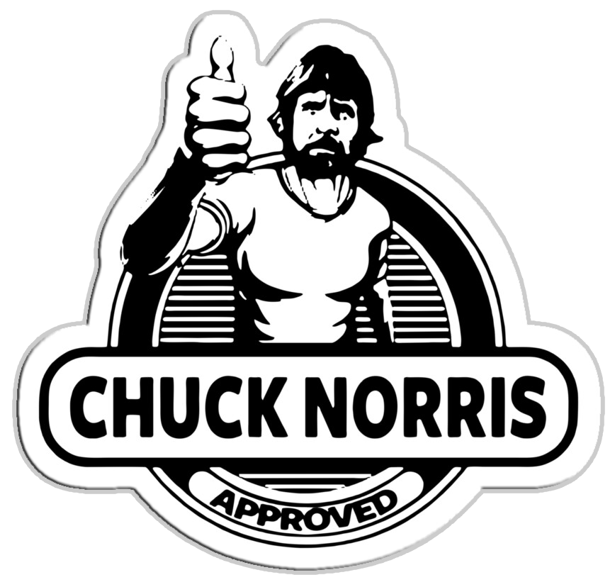

  

# Chuck badass Norris :punch:
Projeto desenvolvido com a api de piadas do Chuck Norris. 

# Tecnologias Utilizadas 🚀
ReactJS 
Axios 
Entre outras...

# Como utilizar o repositório web? 🤔
  1. Clone esse repositório utilizando <code>git clone</code>.
  2. Vá até a raiz do projeto
  3. Rode o comando <code> npm install </code> na raíz da pasta para baixar as dependências.
  4. Rode o comando <code> npm start</code> para inicializar o servidor.

Feito com 💜 por <a href="https://github.com/emysmoura" target="_blank">emysmoura</a>.
